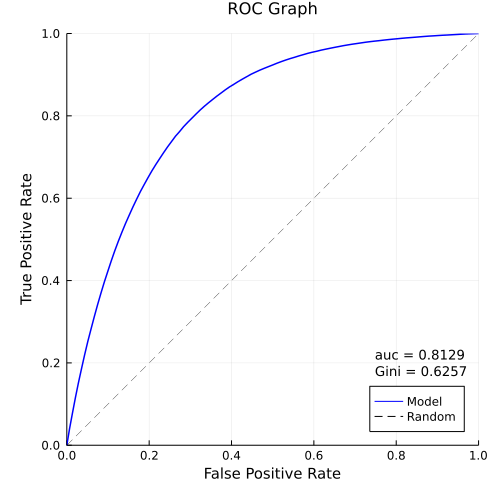
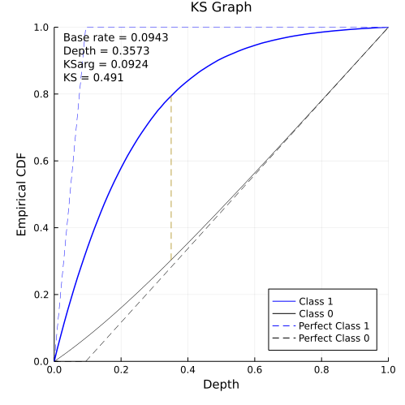
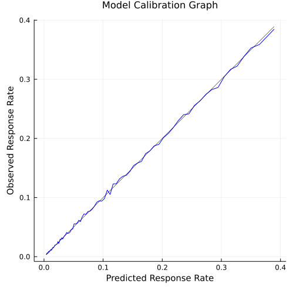
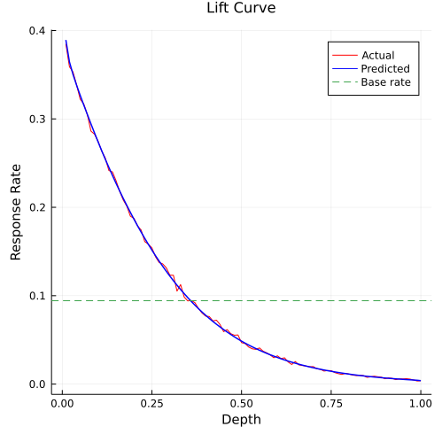

# ROCKS.jl

[](https://DaymondLing.github.io/ROCKS.jl/dev)
[](https://github.com/DaymondLing/ROCKS.jl/actions)
[](https://codecov.io/gh/DaymondLing/ROCKS.jl)

`ROCKS` stands for ROC (Concordance-statistic, Receiver Operating Characteristic)
and KS (Kolmogorov-Smirnov Statistic).

Whether building a binary classifier or auditing one built by someone else,
there are many things we'd like to know about its performance.
This package makes it easy to calculate
ROC and KS for large problems (millions of rows) quickly,
and produce graphs and tables for model performance documentation.

### rocplot



### ksplot



### biasplot



### liftcurve



## Installation

This package is installable via its URL:

```
] add https://github.com/DaymondLing/ROCKS.jl
```

The core of this package is straight forward Julia code which should run
on Julia versions 1.5 or higher. 
It uses `StatsBase` and `FreqTables` for computations,
`Plots` is used for plotting,
and `DataFrames` is used to store/print output tables.

## Functionalities

ROC:
- `roc` computes the C-statistic (concordance statistic), also known as
Area Under Curve or Receiver Operating Characteristic
via concordance calculation rather than numeric integration.
While producing the same result, concordance is more generally useful than ROC.

Kolmogorov-Smirnov statistic:
- `kstest`, 2 sample Kolmogorov-Smirnov separation and location estimate

Plots:

- `bcdiag`, wrapper for `kstest` and `roc` that facilitates using the functions below

- `ksplot`, plot of Kolmogorov-Smirnov separation
- `rocplot`, ROC plot
- `biasplot`, plot of actual response rate vs. predicted probability
- `accuracyplot`, plot of model accuracy given utility values for [TP, FN, FP, TN]
- `liftcurve`, actual and predicted lift curves
- `cumliftcurve`, cumulative actual and predicted lift curves

The returned plot objects can be modified as necessary.

Tables:

- `liftable`, actual and predicted lift tables

- `cumliftable`, cumulative actual and predicted lift tables

DataFrame tables are returned and can be further processed as desired.
