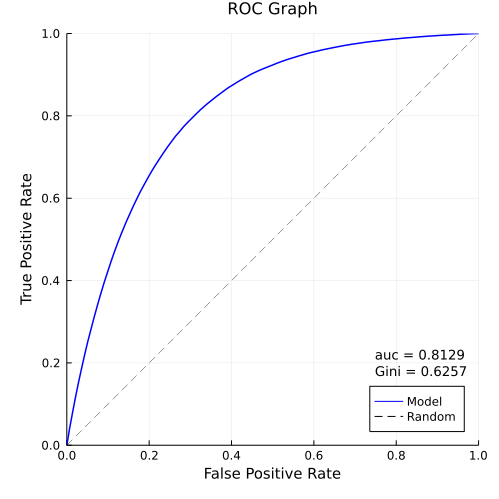

# ROCKS.jl

Two of the commonly used metrics to evaluate the performance of
a binary classifier are:

- C-Statistic (concordance statistic) or Area Under Curve or just ROC
(Receiver Operating Characteristic)

```@raw html

```




- KS-Statistic (Kolmogorov-Smirnov 2 sample CDF max separation)

```@raw html

```


This package makes it easy to calculate ROC and KS, and produce
graphs and tables for documentation purposes.

## Installation

This package is installable via its URL:

```
] add https://github.com/DaymondLing/ROCKS.jl
```
